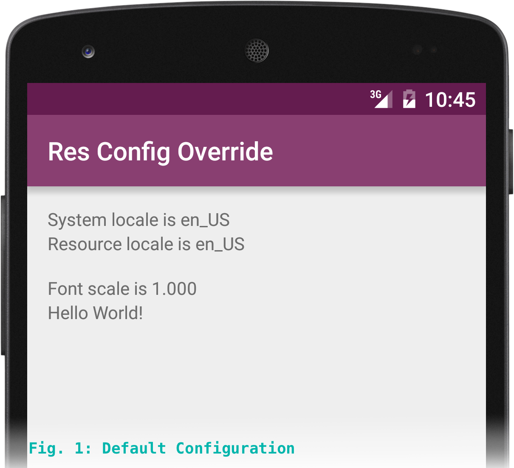
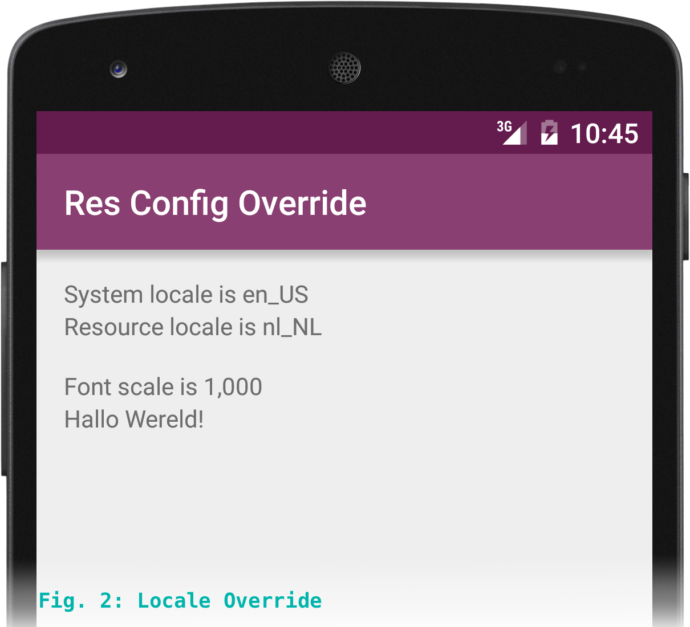
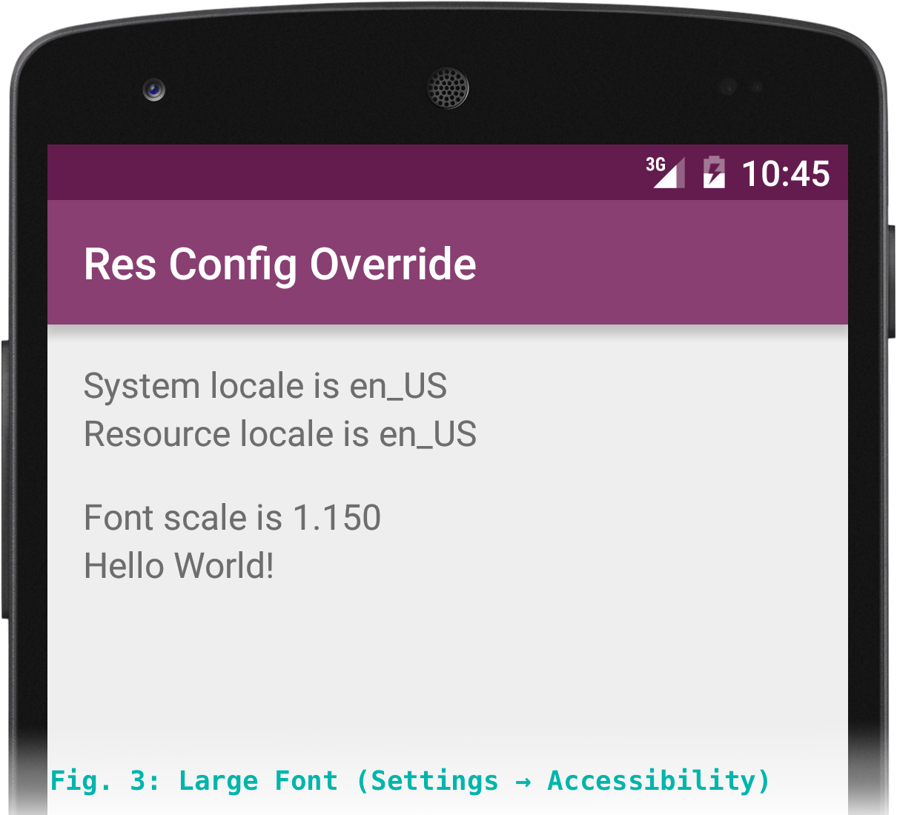
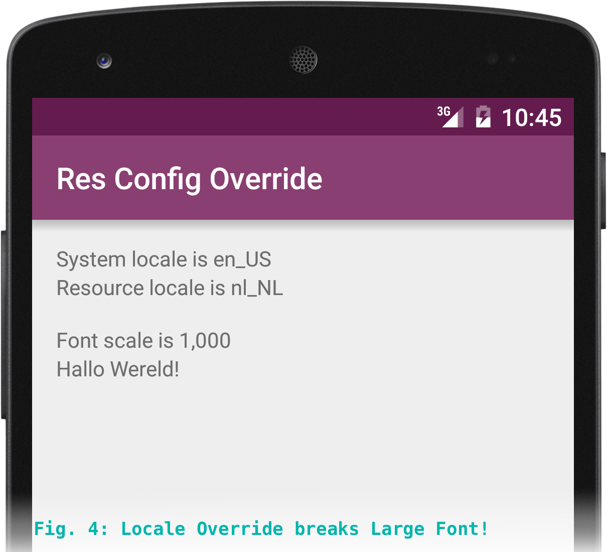
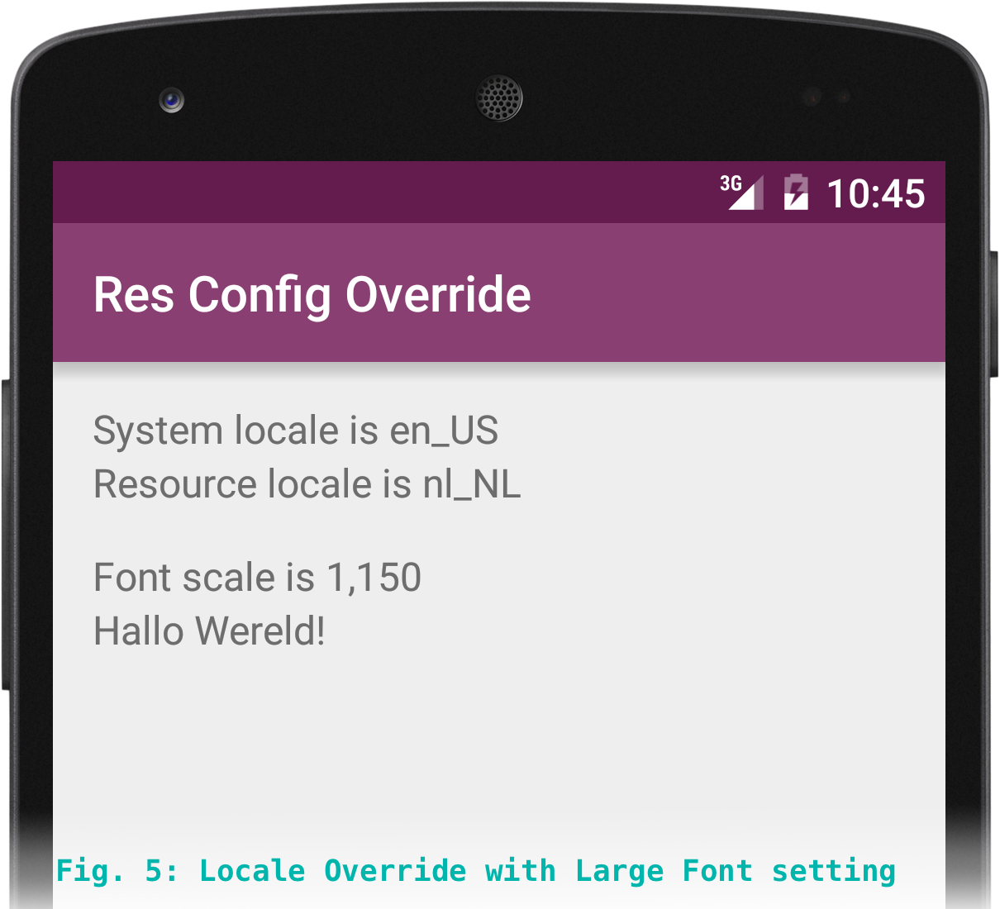

Android override Configuration and large font support

In Android, the resource [`Configuration`][conf] dictates what assets are selected. The system populates a default configuration to match your device and settings (screen size, device orientation, language). Sometimes, you need to deviate from these defaults. Since API 17 you can use [`applyOverrideConfiguration(Configuration)`][aoco] to specify an alternative resource config. The normal place to do so is in the `attachBaseContext(Context)` method of your Activity.

[code]
public class MainActivity extends Activity {

    @Override
    protected void attachBaseContext(Context newBase) {
        super.attachBaseContext(newBase);
        final Configuration override = new Configuration();
        override.locale = new Locale("nl", "NL");
        applyOverrideConfiguration(override);
    }

    //...
}
[/code]

Here's what that looks like:

Unfortunately, there's a catch.<!--more-->

Android has a "Large Text" setting in its accessibility options (and in some cases a different text size setting in the display options). If you use the `overrideConfiguration` method to set your own resource configurtation, you will wipe out the Large Text preference, hurting your accessibilty support. This problem is easily overlooked, and luckily, easily fixed.

The large fonts setting works by changing the `Configuration.fontScale` attribute, which is a `public float`. This with the [scaled density-independent pixels][dpsp] (`sp`'s) that you use to define fontSize attributes. All `sp` dimensions have this `fontScale` multiplier applied. My Nexus 5 has two font size settings, normal at 1.0 and large at 1.3. The Nexus 5 emulator image has four, and many Samsung devices have seven different font sizes you can choose from.

When you set the override configuration, the new Configuration object has its fontScale set to 1.0f, thereby breaking the large fonts mode. To fix this problem, you simply have to copy the current fontScale value from the base context. This is best done using the copy constructor, which will also account for any other properties that come with the same issue.

[code]
public class MainActivity extends Activity {

    @Override
    protected void attachBaseContext(Context newBase) {
        super.attachBaseContext(newBase);
        final Configuration override = new Configuration(
            // Copy the original configuration so it isn't lost.
            newBase.getResources().getConfiguration()
        );
        override.locale = new Locale("nl", "NL");
        applyOverrideConfiguration(override);

        // BTW: You can also access the fontScale value using Settings.System:
        // Settings.System.getFloat(getContentResolver(), Settings.System.FONT_SCALE, 1.0f);
    }

    //...
}
[/code]

The app now works as intended, with accessibility support intact.

Long story short: when you use applyOverrideConfiguration, always test your app in the Large Fonts accessibility setting. Be sure to copy the original Configuration in your new Configuration constructor, or use the System.Settings.FONT_SCALE property to retrieve the font scale separately.

[conf]:http://developer.android.com/reference/android/content/res/Configuration.html
[aoco]:http://developer.android.com/reference/android/view/ContextThemeWrapper.html#applyOverrideConfiguration(android.content.res.Configuration)
[dpsp]:http://developer.android.com/guide/practices/screens_support.html#screen-independence
